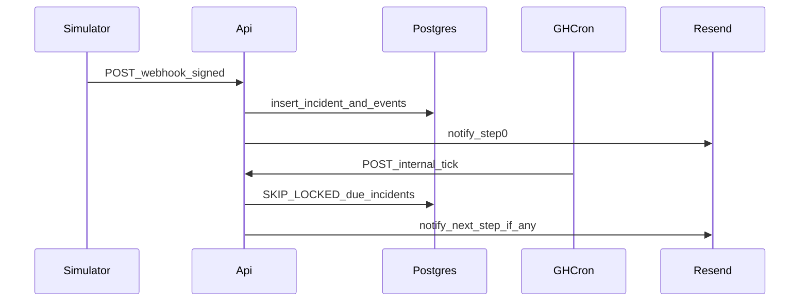

> **Beacon implementation spec** (authoritative). Tracks checkpoints **CP00–CP10**. CP00 scaffold is in-repo; see checklists below for remaining work.

# beacon-oncall — implementation specification (authoritative)

## How to use this document

1. Treat every **Frozen** decision as a hard requirement unless you explicitly revise this doc.
2. Implement checkpoints **CP01 → CP08** in order; **CP04** may begin after **CP03** only if you keep webhook behind a feature flag—recommended order is linear.
3. When code diverges, **update this doc in the same PR** or open a follow-up PR immediately—no silent drift.
4. This spec targets the repository **`beacon-oncall`** with **npm workspaces** (not pnpm). Paths below are repo-relative.

**Canonical copy:** this file is versioned at `docs/BEACON_SPEC.md` in the repo. If you edit the Cursor plan export, re-copy here in the same change.

---

## CP00 snapshot (already in repo)

- Root [package.json](package.json): workspaces `apps/*`, `packages/*`, `tools/simulator`; scripts `dev`, `build`, `verify`, `typecheck`, `test`, `db:generate`, `db:migrate`.
- [apps/api](apps/api): Hono + `@hono/node-server`; `GET /health`, `GET /health/db`.
- [apps/web](apps/web): Next.js App Router; home page fetches `NEXT_PUBLIC_API_URL + /health`.
- [packages/db](packages/db): Drizzle + `postgres` driver; `createDb(url)` in [packages/db/src/index.ts](packages/db/src/index.ts); **CP01** baseline migration + full schema in `packages/db/drizzle/` (see repo README for migrate + seed).
- CI: [.github/workflows/ci.yml](.github/workflows/ci.yml) runs `npm ci` + `npm run verify` (`typecheck`, `test`, `build`).

**CP01 (landed in repo):** baseline migration `0000_faulty_firelord.sql` creates the full schema. If an older dev DB still has `beacon_meta`, drop it or reset the database before migrating.

---

## Frozen product decisions (no ambiguity)

| Topic | Decision |
|------|-----------|
| Severity values | **`SEV1`, `SEV2`, `SEV3`, `SEV4`** stored as **short strings** in Postgres `text` with **CHECK** constraint allowing only those four literals. |
| Incident status values | **`open`**, **`acknowledged`**, **`resolved`** (same literal strings in DB + API). |
| Membership roles | **`owner`**, **`member`**. |
| Escalation targets | **Only** `escalation_steps.notify_user_id` (must reference `users.id` in same org—enforce in app layer in MVP; optional composite FK later). |
| Policies per service | **Exactly one** bound policy per `service_id` (`service_policy_bindings.service_id` is PK). |
| Ack semantics | **`acked_at IS NOT NULL` OR `status = resolved`** ⇒ escalation engine **must not** advance further. |
| Ack endpoint | Allowed only when `status = open` (sets `status=acknowledged` + `acked_at=now()`). |
| Resolve endpoint | Allowed when `status in (open, acknowledged)`; sets `status=resolved`, `resolved_at=now()`, clears `next_action_at` (NULL). |
| First notify | Always immediately when incident is created (step index 0). |
| Last step behavior | After notifying the **last** step, if still unacked when tick fires: set `next_action_at = NULL`, insert `incident_events.type = escalation.exhausted` with payload `{ lastStepIndex }`. **No repeat paging** on last step. |
| Webhook idempotency | Partial unique index on `(org_id, dedupe_key)` for active rows (definition below). |
| Public API auth | `GET /public/:orgSlug/status` has **no** session; returns only non-secret fields. |
| Internal tick auth | Header **`X-Internal-Auth`** equals env **`INTERNAL_TICK_SECRET`** (compare with `crypto.timingSafeEqual` on utf8 bytes). |
| API org routing | All authenticated org APIs live under **`/v1/orgs/:orgSlug`** where `:orgSlug` matches `orgs.slug`. |

---

## Environment variables (complete)

| Name | Required | Consumed by | Purpose |
|------|----------|---------------|---------|
| `DATABASE_URL` | yes (all non-trivial CPs) | api, db scripts | Postgres connection string (Neon). |
| `API_PORT` | no (default `3001`) | api | Listen port. |
| `NEXT_PUBLIC_API_URL` | no (default `http://localhost:3001`) | web | Browser → API origin. |
| `INTERNAL_TICK_SECRET` | yes from CP06 onward | api, GH Actions | Protects `/internal/tick`. Min 32 random bytes base64url. |
| `APP_MASTER_KEY` | yes from CP04 onward | api | 32-byte secret (base64 or hex) for AES-256-GCM encrypting per-org webhook secret at rest. |
| `RESEND_API_KEY` | yes from CP07 onward | api | Email send. |
| `EMAIL_FROM` | yes from CP07 onward | api | Verified sender domain in Resend, e.g. `Beacon <alerts@yourdomain>`. |
| `OPENAI_API_KEY` | optional until CP09 | api / packages/ai | LLM calls; omit in dev to force mock provider. |

**Path B auth extras (if you choose Path B in CP02):** `SESSION_COOKIE_NAME` (default `beacon_session`), `SESSION_SECRET` (HMAC signing, 32+ bytes).

**Path A (Clerk):** follow Clerk docs; you still store `users` row linked by `clerk_user_id` text column (add in CP02 migration).

---

## Repository layout (files to add by checkpoint)

| Path | CP | Purpose |
|------|----|---------|
| [packages/db/src/schema.ts](packages/db/src/schema.ts) | CP01 | Replace placeholder with real tables (split into `schema/*.ts` if file grows). |
| [packages/db/drizzle/](packages/db/drizzle/) | CP01 | Generated SQL migrations only (committed). |
| `packages/db/src/seed.ts` | CP01 | Inserts demo org/users/services/policy/steps/binding. |
| `apps/api/src/lib/db.ts` | CP01 | Singleton `getDb()` using `DATABASE_URL` (wrap `createDb`). |
| `apps/api/src/middleware/*` | CP02 | Session / org membership resolver attaching `c.set('org', ...)`, `c.set('user', ...)`. |
| `apps/api/src/routes/*.ts` | CP03+ | Hono `Hono()` sub-apps mounted in `apps/api/src/index.ts`. |
| `apps/api/src/services/incidents.ts` | CP03–CP06 | Pure functions + SQL transactions for lifecycle + tick. |
| `apps/api/src/services/webhook.ts` | CP04 | Verify + parse + dedupe. |
| `apps/api/src/services/notify.ts` | CP05–CP07 | Interface `Notifier` + `ConsoleNotifier` stub + `ResendNotifier`. |
| `apps/api/test/*.test.ts` | CP04+ | Vitest integration/unit tests. |
| `apps/web/app/(app)/**` | CP08 | Authenticated UI routes (layout checks session). |
| `apps/web/app/public/**` or `app/o/[orgSlug]/status` | CP08 | Public status view calling API read-only endpoint. |
| `tools/simulator/src/index.ts` | CP07 | CLI entry. |
| `packages/ai/**` | CP09 | Model interface + implementations (`MockChatModel`, `OpenAiChatModel`, `postGithubIssueComment`). |
| `apps/api/src/services/action-runs.ts` | CP09 | Create / load / approve action runs + GitHub tool execution. |
| `tools/go-relay/**` | CP10 (optional) | Go binary polling `POST /internal/tick`. |
| `.github/workflows/tick.yml` | CP07 | Cron POST `/internal/tick`. |
| `.github/workflows/simulate.yml` | CP07 | Cron run simulator `steady`. |

---

## Database schema (DDL-level)

Use **UUID v4** generated in app (`crypto.randomUUID()`) or Postgres `gen_random_uuid()` if extension enabled—**pick one project-wide** (recommended: `crypto.randomUUID()` in TS for fewer DB deps).

### Enum-like constraints (Postgres CHECK)

- `memberships.role IN ('owner','member')`
- `incidents.status IN ('open','acknowledged','resolved')`
- `incidents.severity IN ('SEV1','SEV2','SEV3','SEV4')`
- `services.severity` same set
- `notification_attempts.status IN ('pending','sent','failed')`

### Tables (authoritative column list)

**`users`**

| column | type | null | default | notes |
|--------|------|------|---------|------|
| id | uuid | no | | PK |
| email | text | no | | UNIQUE; **normalize to lowercase** in app before insert (avoid `citext` unless you enable extension on Neon). |
| password_hash | text | yes | | null if Clerk-only |
| clerk_user_id | text | yes | | UNIQUE partial: non-null unique (Path A) |
| created_at | timestamptz | no | now() | |

**`orgs`**

| column | type | null | default | notes |
|--------|------|------|---------|------|
| id | uuid | no | | PK |
| slug | text | no | | UNIQUE; CHECK `slug ~ '^[a-z0-9-]+$'` |
| name | text | no | | |
| webhook_secret_cipher | bytea | no | | nonce+ciphertext+tag bytes |
| created_at | timestamptz | no | now() | |

**`memberships`** — PK `(org_id, user_id)`

| column | type | null | default |
|--------|------|------|---------|
| org_id | uuid | no | FK → orgs.id ON DELETE CASCADE |
| user_id | uuid | no | FK → users.id ON DELETE CASCADE |
| role | text | no | CHECK in set |
| created_at | timestamptz | no | now() |

**`services`**

| column | type | null | default |
|--------|------|------|---------|
| id | uuid | no | PK |
| org_id | uuid | no | FK orgs ON DELETE CASCADE |
| name | text | no | |
| description | text | yes | |
| severity | text | no | CHECK SEV |
| created_at | timestamptz | no | now() |

Indexes: `CREATE UNIQUE INDEX services_org_name_lower ON services (org_id, lower(name));`

**`escalation_policies`**

| column | type | null |
|--------|------|------|
| id | uuid | no PK |
| org_id | uuid | no FK CASCADE |
| name | text | no |
| created_at | timestamptz | no default now() |

**`escalation_steps`**

| column | type | null |
|--------|------|------|
| id | uuid | no PK |
| policy_id | uuid | no FK policies ON DELETE CASCADE |
| step_index | int | no CHECK >=0 |
| wait_seconds | int | no CHECK >=0 |
| notify_user_id | uuid | no FK users ON DELETE RESTRICT |

Constraints: `UNIQUE (policy_id, step_index)`; optional `CHECK (step_index BETWEEN 0 AND 31)` to cap demo size.

**`service_policy_bindings`**

| column | type | null |
|--------|------|------|
| service_id | uuid | no PK FK services ON DELETE CASCADE |
| policy_id | uuid | no FK policies ON DELETE RESTRICT |

**`incidents`**

| column | type | null | default |
|--------|------|------|---------|
| id | uuid | no PK |
| org_id | uuid | no FK CASCADE |
| service_id | uuid | no FK RESTRICT |
| status | text | no | `'open'` |
| severity | text | no | snapshot |
| title | text | no | |
| dedupe_key | text | yes | |
| current_step_index | int | no | 0 |
| next_action_at | timestamptz | yes | |
| opened_at | timestamptz | no | now() |
| acked_at | timestamptz | yes | |
| resolved_at | timestamptz | yes | |
| opened_by_user_id | uuid | yes | FK users |
| external_ref | text | yes | |

Indexes:

- `CREATE INDEX incidents_tick_due ON incidents (next_action_at) WHERE resolved_at IS NULL AND acked_at IS NULL AND next_action_at IS NOT NULL;`
- Partial unique (active dedupe):  
  `CREATE UNIQUE INDEX incidents_dedupe_active ON incidents (org_id, dedupe_key) WHERE dedupe_key IS NOT NULL AND status IN ('open','acknowledged');`

**`incident_events`**

| column | type | null |
|--------|------|------|
| id | uuid | no PK |
| incident_id | uuid | no FK incidents ON DELETE CASCADE |
| org_id | uuid | no FK orgs ON DELETE CASCADE |
| type | text | no |
| payload | jsonb | no default '{}' |
| actor_user_id | uuid | yes |
| created_at | timestamptz | no default now() |

Index: `(incident_id, created_at asc)`

**`notification_attempts`**

| column | type | null |
|--------|------|------|
| id | uuid | no PK |
| incident_id | uuid | no FK CASCADE |
| step_index | int | no |
| to_email | text | no |
| status | text | no default 'pending' |
| attempt | int | no default 1 |
| last_error | text | yes |
| created_at | timestamptz | no default now() |
| updated_at | timestamptz | no default now() |

Unique suggestion: `UNIQUE (incident_id, step_index, attempt)` to allow retry bumps (`attempt+1` new row **or** update same row—**pick update-in-place** for simplicity: no unique, always update latest row per `(incident_id,step_index)` via `ORDER BY attempt DESC LIMIT 1`—simplest MVP: **one row per step** updated: add unique `(incident_id, step_index)` and on retry increment `attempt` column in place.

---

## Core algorithms (pseudocode — implement exactly)

### A) `openIncident({ orgId, serviceId, title, severity, source, dedupeKey?, openedByUserId?, externalRef? })` — single DB transaction

1. Assert service belongs to org; load bound `policy_id`; load ordered steps `0..N-1` by `step_index asc`. If missing policy or zero steps → **400** `policy_missing`.
2. Insert `incidents` row: `status=open`, `severity` from arg (or service default), `dedupe_key` optional, timestamps set, `current_step_index=0`, `next_action_at=null` temporarily.
3. Insert `incident_events` `incident.opened` with payload `{ source, dedupeKey }`.
4. Call `notifyIncidentStep({ incidentId, stepIndex: 0 })` (see C) — if notify hard-fails (HTTP error) still keep incident but record `notify.failed` and **continue** (do not rollback incident creation unless you choose strong consistency—**MVP: do not rollback**).
5. Set `next_action_at = now() + step0.wait_seconds` (use row for index 0).
6. Commit.

### B) `ingestWebhook(orgSlug, rawBodyBytes, headers)` — before DB work

1. Resolve org by slug; if missing → **404** `org_not_found`.
2. Decrypt `webhook_secret_cipher` → `secret` bytes/string.
3. Verify HMAC as in **Webhook verification** section; on failure → **401** `bad_signature` / `stale_timestamp`.
4. `JSON.parse` to object; validate **WebhookBodySchema** (Zod). If invalid → **400** `bad_payload`.
5. If `dedupeKey` present: `SELECT id FROM incidents WHERE org_id=? AND dedupe_key=? AND status in ('open','acknowledged')` — if found return **200** `{ incidentId, deduped: true }` **without** creating a new row.
6. Else call `openIncident` with `source='webhook'`, `dedupeKey`, `externalRef=payload.externalRef`.

### C) `notifyIncidentStep({ incidentId, stepIndex })`

1. Load incident + org + step row for `policy` at `stepIndex`; resolve `notify_user_id` → user email (must exist).
2. Insert or update `notification_attempts` row for `(incident_id, step_index)` to `pending`.
3. Call `Notifier.send({ to, subject, text })`.
4. On success: mark `sent`, append `notify.sent` with `{ stepIndex, to }` redacting PII if needed.
5. On failure: mark `failed`, append `notify.failed` with `{ stepIndex, errorCode }`, store `last_error` truncated 500 chars.

### D) `ackIncident(incidentId, actorUserId)` — transaction

1. `SELECT … FOR UPDATE` incident; if not found → 404.
2. If `status != 'open'` → **409** `invalid_state`.
3. Set `status='acknowledged'`, `acked_at=now()`.
4. Set `next_action_at = NULL` (stop future escalation).
5. Event `incident.acknowledged`.

### E) `resolveIncident(incidentId, actorUserId)` — transaction

1. Lock row; if `status == 'resolved'` idempotent **200** return.
2. If `status` not in (`open`,`acknowledged`) → **409** (should not happen).
3. Set `status='resolved'`, `resolved_at=now()`, `next_action_at=NULL`.
4. Event `incident.resolved`.

### F) `processTickBatch({ limit=50 })` — one scheduler invocation

```
processed=0; advanced=0; errors=0
BEGIN
  rows = SELECT id FROM incidents WHERE ... SKIP LOCKED LIMIT limit
for id in rows:
  BEGIN subtx
    inc = SELECT * FROM incidents WHERE id=id FOR UPDATE
    if inc.acked_at or inc.resolved_at: COMMIT subtx; processed++; continue
    if inc.next_action_at is null or inc.next_action_at > now(): COMMIT subtx; processed++; continue
    if inc.current_step_index == lastStepIndex:
       UPDATE incidents SET next_action_at=NULL WHERE id=id
       INSERT incident_events escalation.exhausted
       COMMIT subtx; processed++; continue
    newIndex = inc.current_step_index + 1
    UPDATE incidents SET current_step_index=newIndex WHERE id=id
    INSERT incident_events escalation.advanced {from,to}
    notifyIncidentStep(id, newIndex)
    load newStep.wait_seconds; UPDATE incidents SET next_action_at=now()+wait WHERE id=id
    COMMIT subtx; processed++; advanced++
  EXCEPTION
    errors++; ROLLBACK subtx
END
return {processed, advanced, errors}
```

---

## Webhook verification (byte-accurate)

Let `rawBody` be the **exact** POST bytes (UTF-8 JSON).

`timestamp` = integer seconds from header `X-Beacon-Timestamp`.

`signatureHeader` = `X-Beacon-Signature` value `v1=<hex>`.

`macInput = utf8("v1:" + timestamp + ":" + rawBodyUtf8Decode)` — **use the same UTF-8 decoding as client**; simplest is treat body as UTF-8 string concatenation after verifying bytes decode as UTF-8.

`expectedHex = HMAC_SHA256(key=utf8(orgSecret), message=utf8(macInput))` lowercase hex.

Compare `expectedHex` to header hex using `timingSafeEqual(Buffer.from(expectedHex,'utf8'), Buffer.from(providedHex,'utf8'))` (normalize case).

**Worked example (fake values):**

- `timestamp = "1710000000"`
- `rawBody = '{"schemaVersion":1,"dedupeKey":"x","serviceId":"…","title":"t","severity":"SEV2"}'`
- `macInput = v1:1710000000:{rawBody}`
- Secret = `whsec_test_123` (utf8)

Client must send **identical** raw bytes as server verifies.

---

## Zod schemas (normative field names)

**`WebhookBodySchema`**

- `schemaVersion` literal `1`
- `dedupeKey` string min 1 max 200 optional
- `serviceId` uuid string
- `title` string min 1 max 200
- `severity` enum `SEV1|SEV2|SEV3|SEV4`
- `externalRef` string max 200 optional

**`ManualCreateIncidentSchema`**

- `serviceId` uuid
- `title` string
- `severity` optional enum (defaults to service.severity)

**`CreatePolicySchema`**

- `name` string
- `steps`: non-empty array ordered as sent, each `{ waitSeconds: number int >=0, notifyUserId: uuid }` (server validates user membership in org)

**`BindPolicySchema`**

- `policyId` uuid

---

## HTTP API catalog (status codes explicit)

Global error JSON: `{ "error": { "code": "snake_case", "message": "human readable" } }`

### Unauthenticated

| Method | Path | Success | Errors |
|--------|------|-----------|--------|
| GET | `/health` | 200 `{ ok:true, service:'beacon-api', time: ISO }` | — |
| GET | `/health/db` | 200 `{ ok:true }` if DB `select 1` works | 503 if `DATABASE_URL` missing; 500 DB down |
| GET | `/public/:orgSlug/status` | 200 JSON per **PublicStatusResponse** below | 404 unknown slug |

**`PublicStatusResponse`**

```json
{
  "org": { "slug": "acme", "name": "Acme" },
  "active": [{ "id": "uuid", "title": "...", "severity": "SEV2", "status": "open", "openedAt": "ISO" }],
  "recentResolved": [{ "id": "uuid", "title": "...", "severity": "SEV1", "resolvedAt": "ISO" }]
}
```

Rules: include incidents where `status in ('open','acknowledged')` in `active`; `recentResolved` last N by `resolved_at desc` where `status='resolved'` within `status_page_settings.show_resolved_hours` (default 72h) — if settings row missing use default.

### Authenticated (session cookie or bearer—document choice in CP02 README)

All below require membership for `:orgSlug`.

| Method | Path | Body | Success | Errors |
|--------|------|------|---------|--------|
| POST | `/v1/orgs/:orgSlug/services` | `{ name, description?, severity }` | 201 service | 409 name conflict |
| GET | `/v1/orgs/:orgSlug/services` | — | 200 list | |
| PATCH | `/v1/orgs/:orgSlug/services/:serviceId` | partial name/description/severity | 200 | 404 |
| POST | `/v1/orgs/:orgSlug/policies` | `CreatePolicySchema` | 201 `{ policyId }` | 400 validation; 400 notify user not member |
| GET | `/v1/orgs/:orgSlug/policies` | — | 200 | |
| POST | `/v1/orgs/:orgSlug/services/:serviceId/policy` | `{ policyId }` | 204 | 404 |
| POST | `/v1/orgs/:orgSlug/incidents` | `ManualCreateIncidentSchema` | 201 `{ incidentId }` | 400/404 |
| GET | `/v1/orgs/:orgSlug/incidents` | query `status?` | 200 array | |
| GET | `/v1/orgs/:orgSlug/incidents/:incidentId` | — | 200 incident detail + last timeline optional | 404 |
| POST | `/v1/orgs/:orgSlug/incidents/:incidentId/ack` | empty | 204 | 409 invalid state |
| POST | `/v1/orgs/:orgSlug/incidents/:incidentId/resolve` | empty | 204 | 409 |
| GET | `/v1/orgs/:orgSlug/incidents/:incidentId/events` | — | 200 chronologically asc | 404 |
| POST | `/v1/orgs/:orgSlug/webhook-secret/rotate` | empty | 200 `{ secretPlaintextOnce }` | 403 not owner |

### Webhook (no session)

| Method | Path | Success | Errors |
|--------|------|---------|--------|
| POST | `/v1/webhooks/:orgSlug/ingest` | raw bytes body | 200 `{ incidentId, deduped?:boolean }` | 401/400/404 as above |

### Internal

| Method | Path | Headers | Success | Errors |
|--------|------|---------|---------|--------|
| POST | `/internal/tick` | `X-Internal-Auth: <secret>` | 200 `{ processed, advanced, errors }` | 401 bad/missing secret |

---

## Email templates (CP07)

- **Subject:** `[${severity}] ${title}`
- **Text body:** first line `Incident: ${incidentId}`; second line deep link `${PUBLIC_WEB_ORIGIN}/orgs/${orgSlug}/incidents/${incidentId}` (add `PUBLIC_WEB_ORIGIN` env to api).
- **HTML body:** optional minimal link.

No ack links.

---

## Simulator (CP07) — CLI contract

**Package:** `tools/simulator` (type module), run via `npm exec beacon-sim` after adding `bin` mapping in its package.json **or** `node tools/simulator/dist/index.js`.

**Required argv/env:**

- `--baseUrl` (e.g. `https://api.example.com`)
- `--orgSlug`
- `--serviceId` uuid
- `--secret` plaintext webhook secret (from rotate endpoint)
- `steady --minutes 15` or `burst --count 20 --concurrency 5`

**Signing:** identical algorithm to server; timestamp = `Math.floor(Date.now()/1000)` string.

**Body:** always `WebhookBodySchema` JSON with stable `dedupeKey` pattern `sim:${randomUuid}` for bursts; for steady you may reuse dedupe every run **only if** prior incident resolved—simpler: always random dedupe for MVP demos.

---

## GitHub Actions workflows (normative)

### `tick.yml`

- `on.schedule`: `*/5 * * * *`
- Steps: `curl -fsS -X POST "$API_BASE_URL/internal/tick" -H "X-Internal-Auth: $INTERNAL_TICK_SECRET"`

### `simulate.yml`

- `on.schedule`: `*/15 * * * *`
- Steps: checkout, setup-node, `npm ci`, `npm exec …` running simulator `steady` with secrets.

---

## Testing (Vitest) — files & cases

Location: `apps/api/test/` (configure Vitest root in `apps/api`).

Minimum files:

- `webhook.security.test.ts` — bad sig, stale ts, happy path
- `webhook.dedupe.test.ts` — double submit same dedupe while open returns same id
- `escalation.tick.test.ts` — sets `next_action_at` in past, calls handler, expects step index + notify row + events
- `escalation.race.test.ts` — concurrent ack + tick (use two promises + pg isolation)
- `incident.resolve.test.ts` — resolved prevents advance

Use a **real Postgres** via docker compose service `postgres:16` in CI optional job, or **Testcontainers**—at least one integration path before claiming CP06 done.

---

## Checkpoint acceptance criteria (checkboxes)

### CP01

- [x] `beacon_meta` removed or unused; all tables above exist in Drizzle + SQL migration.
- [x] All indexes created.
- [x] `npm run db:migrate` succeeds on empty DB.
- [x] `npm run -w @beacon/db` seed creates: 1 org `demo`, 2 users (owner+oncall), 1 service, 1 policy with 2 steps, binding.

### CP02

- [x] Login/session works; cookie flags documented.
- [x] Middleware attaches `orgId` only if membership exists.
- [x] `GET /v1/orgs/demo/services` returns 401 unauth, 403 wrong user, 200 member.

### CP03

- [x] Manual create returns 201; list/filter works; ack/resolve transitions match Frozen table.

### CP04

- [x] Webhook route uses raw body verification before JSON parse.
- [x] Dedupe index enforced; tests pass (HMAC unit tests; dedupe via partial unique + `findActiveIncidentByDedupe`).

### CP05

- [x] Creating incident triggers notify step0 (stub notifier ok) and sets `next_action_at`.

### CP06

- [x] `/internal/tick` implements pseudocode F with metrics.
- [x] Tests for tick + race + resolve + webhook dedupe pass against Postgres (`npm run test:integration -w @beacon/api`, Testcontainers; CI job `integration`).

### CP07

- [x] Resend send works from dev when `RESEND_API_KEY` + `EMAIL_FROM` are set (otherwise console notifier).
- [x] Both GH workflows present (`tick.yml`, `simulate.yml`); they no-op until repo secrets are configured.

### CP08

- [x] Core operator + public pages (incidents list + public status); further CRUD UIs can extend the same patterns.
- [x] Public status page requires no login.

### CP09

- [x] Mock model tests pass CI without `OPENAI_API_KEY` (`@beacon/ai` Vitest).
- [x] Approve path executes `github.issue_comment` (integration test mocks GitHub HTTP + asserts URL/body/PAT; optional manual check with real PAT + fork repo below).

### CP10

- [x] Go relay skeleton (`tools/go-relay`) posts `/internal/tick` on an interval; optional separate CI job for `go build`.

---

## Threat model notes (for README)

- Webhook secret is **per org**; rotation invalidates old monitors within seconds of deploy.
- `/internal/tick` must never be exposed without secret; prefer allowlist IP only if on public internet (Cloudflare Access) — optional.
- Never log `X-Internal-Auth`, webhook secrets, GitHub PATs.
- `PUBLIC` status endpoint must not leak emails or internal user ids—only incident id/title/severity/timestamps.

---

## Implementation order inside CP01 (suggested migration splits)

1. `0001_init_core.sql` — users, orgs, memberships, services (no policies yet) OR single migration if you prefer.
2. Policies + steps + bindings + incidents + events + notifications in same migration file is OK if size manageable.

**Drizzle codegen:** after editing `schema.ts`, always `DATABASE_URL=... npm run db:generate` then commit `packages/db/drizzle/*`.

---

## Optional packages (CP09) — **landed** in-repo

`packages/ai` exports:

```ts
export interface ChatModel { runToolLoop(input: { incidentId: string; orgId: string }): AsyncIterable<ToolEvent> }
```

Implementations: `OpenAiChatModel`, `MockChatModel` (returns one gated `github.issue_comment` proposal).

---

## Done definitions (recruiter-facing)

- **Shippable MVP:** CP01–CP08 complete + deployed + README threat model + 2-minute demo video path scripted in README.
- **Strong AI signal:** CP09 with approval UI + one successful GitHub mutation in screen recording.

---

## Appendix: mermaid — request flows


